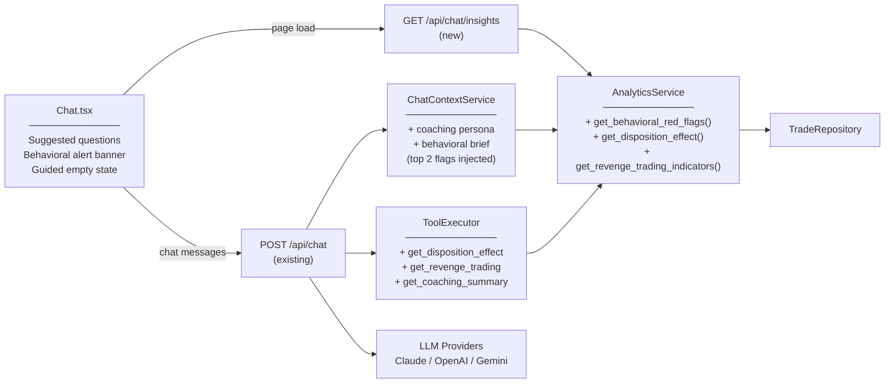

# Portfolio Chat Coaching Improvements — Plan

## 1. Problem Summary

The portfolio chat assistant has solid data access and 12 analytical tools, but functions primarily as a Q&A lookup tool. It answers direct questions but never proactively surfaces trading patterns, doesn't guide the user toward insight, and doesn't connect individual trade decisions to systematic behavioral tendencies in a coached, educational way. The system prompt frames the AI as a "concise assistant" rather than a coach, so even when the AI has the data to spot a recurring mistake, it waits to be asked. The goal is to transform the assistant from a reactive lookup tool into a proactive trading coach that helps the user recognize and correct behavioral patterns over time.

**Users & Usage:** Single user, episodic use (after a trade, end of week, portfolio review). Not a daily habit yet — the improvements should make it more worth opening.

**Success criteria:** In 6 months, the user can point to a specific trade decision that improved because the assistant surfaced a behavioral pattern they weren't consciously aware of.

---

## 2. Architecture

The key architectural move is injecting a **behavioral brief** into the system prompt at context-build time. `ChatContextService` calls `AnalyticsService.get_behavioral_red_flags()` and prepends the top 2 specific, data-backed flags into the system prompt — so the AI enters every conversation already knowing what patterns to watch for, without the user having to ask. The AI persona shifts from "concise assistant" to "trading coach." All other changes (new tools, UI chips, insights endpoint) build on top of this foundation.

---

## 3. Components & Patterns

| Component | Pattern | Why | Interface / contract |
|---|---|---|---|
| Behavioral flag detection | Strategy | Each flag type (disposition effect, revenge trading, holding asymmetry) has independent detection logic; new flag types must not require touching existing ones | `class BehavioralFlag(Protocol): def detect(trades) -> Optional[FlagResult]` |
| ChatContextService brief injection | Template Method | `build()` already follows a fixed template; `_build_behavioral_brief()` is a new step injected without structural change | `_build_behavioral_brief() -> str` called inside `_build_context()` |
| Suggested questions | Value Object | Questions are computed data, not behavior; a typed list returned from `/api/chat/insights` or embedded in the UI | `list[SuggestedQuestion(text: str, tool_hint: str)]` |
| New tool wiring | Registry (existing) | No new pattern needed; established convention already works | One `_TOOL_DEFS` entry + one `_DISPATCH` entry + one `AnalyticsService` method |
| Coaching system prompt persona | Extracted constant | Persona is currently hardcoded mid-method; extract so it can be tested and changed without touching logic | `COACHING_PERSONA: str` at top of `chat_context_service.py` |

---

## 4. Data Model

No new database tables required for any milestone. All behavioral flags are computed dynamically from the existing `trades` table.

**New query patterns added to `AnalyticsService`:**

| Query | Purpose | Frequency | Latency budget |
|---|---|---|---|
| Trades within 48h of a realized loss > 5% | Revenge trading detection | Per context build (cached on trade_count/max_id) | <100ms |
| Closed lots grouped winner/loser by holding days | Disposition effect ratio | Per context build (cached) | <100ms |
| Exits vs. 30-day subsequent high for closed lots | Exit quality aggregate ("did I sell too early") | On demand via tool | <500ms (yfinance) |
| Trades grouped by day-of-week | Entry timing pattern detection | On demand via tool | <50ms |

**Existing cache in `ChatContextService` (`_context_cache` keyed on `(trade_count, max_id)`) is sufficient.** Behavioral flags are computed inside `_build_context()` and cached at the same key.

**Deferred (v2):** A `coaching_insights` table to track which flags were surfaced per session — enables the AI to avoid repeating the same pattern every conversation and track whether advice was acted on.

---

## 5. Milestones

| # | Milestone | Depends on | Risks | Mitigation | Definition of done |
|---|---|---|---|---|---|
| M1 | Coaching persona + behavioral brief injected into system prompt | Nothing | Flags computed wrong; prompt too long | Unit-test `get_behavioral_red_flags()`; cap brief at 300 chars; silent fallback to empty brief on exception | System prompt includes coach persona + ≥1 data-specific behavioral flag with actual numbers; visible in backend logs |
| M2 | Guided empty state + suggested question chips in Chat UI | Nothing (UI-only, independent) | Questions feel generic | Pull real portfolio numbers into question text (e.g. "You've paid $X in fees — want a breakdown?") | 4–5 data-driven chips appear in empty state; clicking one sends it as a message |
| M3 | New coaching tools: `get_disposition_effect`, `get_revenge_trading_indicators`, `get_coaching_summary` | M1 | FIFO edge cases; revenge trading heuristic noisy | Unit tests per tool; configurable loss threshold (default 5%); verify against real trade data | All 3 tools registered, dispatched, return structured JSON; AI invokes them on relevant questions |
| M4 | `GET /api/chat/insights` endpoint + behavioral alert banner in UI | M3 | Alert feels alarming | Frame as observation: "Insight: you tend to hold losers 2× longer than winners" | Endpoint returns top 2 flags with supporting data; banner visible on chat load with dismiss |
| M5 | Suggested follow-up questions after tool responses | M1 | Feels robotic mid-conversation | Only append after tool-use responses; limit to 2 questions max | After any tool response the AI includes a short "You might also ask:" section with specific, data-referencing questions |

**DEFERRED:**
- Per-session coaching history (DB schema) — safe to defer because each session re-computes flags from live data; no state is lost
- Multi-session progress tracking ("last month you improved on X") — needs the `coaching_insights` table; tackle in v2
- Full journaling workflow with freeform trade notes — out of scope; this is a chat assistant, not a journal app
- Automatic exit regret detection on all closed lots at context-build time — yfinance calls on every exit is too expensive; keep this as an on-demand tool only

**BLAST RADIUS:** If behavioral brief computation fails, `_build_behavioral_brief()` catches and returns empty string — existing behavior is fully preserved. All UI changes are additive. No database writes in any milestone. Worst case: coaching features are silently absent, not broken.

---

## 6. Risks & Red-Team Findings

| Risk | Severity | Why it matters | Earliest detection point |
|---|---|---|---|
| Behavioral flags computed wrong (FIFO edge cases, small sample size) | H | Wrong analysis destroys trust — if the AI says "you hold losers 3× longer" and that's false, the user dismisses the whole feature | M1 unit tests; verify against real trades before shipping |
| Coaching tone feels preachy or repetitive | H | User disengages if AI lectures them every session with the same pattern | M2 first real use; mitigation: surface the same flag at most once per session (even before DB tracking is built, the system prompt can say "mention each pattern at most once") |
| Suggested questions feel generic and are ignored immediately | M | If questions don't reference real portfolio data (actual numbers, specific tickers), they read as lorem ipsum | M2; mitigation: require every suggested question to include at least one real number or ticker name from portfolio data |
| System prompt size increases → latency and token cost | M | Behavioral brief adds ~300 chars to an already large prompt; Haiku is cheap so cost is not an issue, but latency on slow connections is noticeable | M1 load test; mitigate by keeping brief under 350 chars max |
| `get_revenge_trading_indicators` too noisy with a small trade history | L | With <50 trades, the heuristic may flag normal re-entries as "revenge trading" — false positives are worse than no insight | M3; mitigate with minimum sample size check (require ≥3 qualifying events before surfacing flag) |

---

## 7. Open Questions

1. **Disposition effect sample size:** With the current trade history, is there a statistically meaningful signal? Should we require a minimum number of closed lots (e.g., 10+) before surfacing disposition effect as a flag? *(Blocks M1 accuracy)*
2. **Coaching tone preference:** Should the AI lead with the pattern ("I've noticed you tend to...") or ask a Socratic question first ("How do you decide when to exit a losing position?")? These produce very different conversations. *(Blocks M1 system prompt writing)*
3. **Suggested questions: static vs. dynamic:** Should the chips in the empty state be pre-written templates (fast, always available) or dynamically generated from portfolio state on page load (richer, adds one API call)? *(Blocks M2 implementation choice)*
4. **Behavioral brief update frequency:** Should the brief re-compute on every page load (accurate) or only when a new trade is added (the current cache key handles this already)? The current cache is fine — confirming this is the right behavior. *(Blocks M1 caching strategy)*
5. **Coaching tone across providers:** The behavioral brief is injected into the system prompt for all 3 LLM providers. GPT-4o-mini and Gemini Flash may interpret the coaching persona very differently than Claude. Is consistency across providers a requirement, or is it acceptable for each to have its own "coaching style"? *(Blocks M1 cross-provider testing)*

---

## Execution Summary — 2026-04-23

- Branch: plan/portfolio-chat-coaching
- Milestones completed: 5 of 5 (+ 1 post-validation fix commit)
- Waves executed: 3 waves (Wave 1: M1+M2 parallel; Wave 2: M3+M5 parallel; Wave 3: M4 sequential)
- Final verdict: READY_TO_MERGE (after threshold alignment fix — committed as 5355c7c)
- Unresolved risks:
  - [MEDIUM] Coaching tone repetition per session relies on LLM compliance; no server-side dedup (deferred — requires coaching_insights DB table per plan)
  - [MEDIUM] M5 follow-up skip for factual lookups is prompt-only, not server-enforced (accepted as best-effort)
  - [LOW] Double FIFO pass per context build (get_behavioral_red_flags + _build_context both run fifo_closed_lots); acceptable at current trade volume
  - [LOW] disposition_summary null ambiguous between error vs. insufficient data; no current consumer differentiates
- Next steps: rebuild Docker images (`docker compose up --build backend frontend -d`), then manually test the chat with a real question to verify coaching persona, behavioral banner, and question chips all appear correctly

See docs/plans/portfolio-chat-coaching.execution.md for milestone-by-milestone detail.
See docs/plans/portfolio-chat-coaching.context.md for the codebase context used during execution.
